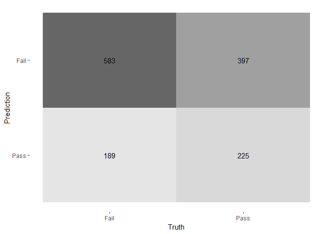

# The Bechdel Test

<https://fivethirtyeight.com/features/the-dollar-and-cents-case-against-hollywoods-exclusion-of-women/>

The [Bechdel test](https://bechdeltest.com) is a way to assess how women
are depicted in Hollywood movies. In order for a movie to pass the test:

1.  It has to have at least two \[named\] women in it
2.  Who talk to each other
3.  About something besides a man

There is a nice article and analysis you can find here
<https://fivethirtyeight.com/features/the-dollar-and-cents-case-against-hollywoods-exclusion-of-women/>
We have a sample of 1394 movies and we want to fit a model to predict
whether a film passes the test or not.

    bechdel <- read_csv(here::here("data", "bechdel.csv")) %>% 
      mutate(test = factor(test)) 
    glimpse(bechdel)

    ## Rows: 1,394
    ## Columns: 10
    ## $ year          <dbl> 2013, 2013, 2013, 2013, 2013, 2013, 2013, 2013, 2013, 2013, 2013,…
    ## $ title         <chr> "12 Years a Slave", "2 Guns", "42", "47 Ronin", "A Good Day to Di…
    ## $ test          <fct> Fail, Fail, Fail, Fail, Fail, Pass, Pass, Fail, Pass, Pass, Pass,…
    ## $ budget_2013   <dbl> 2.00, 6.10, 4.00, 22.50, 9.20, 1.20, 1.30, 13.00, 4.00, 2.50, 5.0…
    ## $ domgross_2013 <dbl> 5.311, 7.561, 9.502, 3.836, 6.735, 1.532, 1.801, 6.052, 14.843, 3…
    ## $ intgross_2013 <dbl> 15.861, 13.249, 9.502, 14.580, 30.425, 8.732, 1.801, 24.437, 24.9…
    ## $ rated         <chr> "R", "R", "PG-13", "PG-13", "R", "R", "PG-13", "PG-13", "R", "R",…
    ## $ metascore     <dbl> 97, 55, 62, 29, 28, 55, 48, 33, 90, 58, 52, 78, 83, 53, 59, 62, 6…
    ## $ imdb_rating   <dbl> 8.3, 6.8, 7.6, 6.6, 5.4, 7.8, 5.7, 5.0, 7.5, 7.4, 6.2, 7.4, 8.0, …
    ## $ genre         <chr> "Biography", "Action", "Biography", "Action", "Action", "Drama", …

How many films fail/pass the test, both as a number and as a %?

## Movie scores

    ggplot(data = bechdel, aes(
      x = metascore,
      y = imdb_rating,
      colour = test
    )) +
      geom_point(alpha = .3, size = 3) +
      scale_colour_manual(values = c("tomato", "olivedrab")) +
      labs(
        x = "Metacritic score",
        y = "IMDB rating",
        colour = "Bechdel test"
      ) +
     theme_light()

# Split the data

    # **Split the data**

    set.seed(123)

    data_split <- initial_split(bechdel, # updated data
                               prop = 0.8, 
                               strata = test)

    bechdel_train <- training(data_split) 
    bechdel_test <- testing(data_split)

Check the counts and % (proportions) of the `test` variable in each set.

## Feature exploration

## Any outliers?

    bechdel %>% 
      select(test, budget_2013, domgross_2013, intgross_2013, imdb_rating, metascore) %>% 

        pivot_longer(cols = 2:6,
                   names_to = "feature",
                   values_to = "value") %>% 
      ggplot()+
      aes(x=test, y = value, fill = test)+
      coord_flip()+
      geom_boxplot()+
      facet_wrap(~feature, scales = "free")+
      theme_bw()+
      theme(legend.position = "none")+
      labs(x=NULL,y = NULL)

## Scatterplot - Correlation Matrix

Write a paragraph discussing the output of the following

    bechdel %>% 
      select(test, budget_2013, domgross_2013, intgross_2013, imdb_rating, metascore)%>% 
      ggpairs(aes(colour=test), alpha=0.2)+
      theme_bw()

## Categorical variables

Write a paragraph discussing the output of the following

    bechdel %>% 
      group_by(genre, test) %>%
      summarise(n = n()) %>% 
      mutate(prop = n/sum(n))

    ## # A tibble: 24 × 4
    ## # Groups:   genre [14]
    ##    genre     test      n  prop
    ##    <chr>     <fct> <int> <dbl>
    ##  1 Action    Fail    260 0.707
    ##  2 Action    Pass    108 0.293
    ##  3 Adventure Fail     52 0.559
    ##  4 Adventure Pass     41 0.441
    ##  5 Animation Fail     63 0.677
    ##  6 Animation Pass     30 0.323
    ##  7 Biography Fail     36 0.554
    ##  8 Biography Pass     29 0.446
    ##  9 Comedy    Fail    138 0.427
    ## 10 Comedy    Pass    185 0.573
    ## # ℹ 14 more rows

    bechdel %>% 
      group_by(rated, test) %>%
      summarise(n = n()) %>% 
      mutate(prop = n/sum(n))

    ## # A tibble: 10 × 4
    ## # Groups:   rated [5]
    ##    rated test      n  prop
    ##    <chr> <fct> <int> <dbl>
    ##  1 G     Fail     16 0.615
    ##  2 G     Pass     10 0.385
    ##  3 NC-17 Fail      5 0.833
    ##  4 NC-17 Pass      1 0.167
    ##  5 PG    Fail    115 0.561
    ##  6 PG    Pass     90 0.439
    ##  7 PG-13 Fail    283 0.529
    ##  8 PG-13 Pass    252 0.471
    ##  9 R     Fail    353 0.568
    ## 10 R     Pass    269 0.432

# Train first models. `test ~ metascore + imdb_rating`

    lr_mod <- logistic_reg() %>% 
      set_engine(engine = "glm") %>% 
      set_mode("classification")

    lr_mod

    ## Logistic Regression Model Specification (classification)
    ## 
    ## Computational engine: glm

    tree_mod <- decision_tree() %>% 
      set_engine(engine = "C5.0") %>% 
      set_mode("classification")

    tree_mod 

    ## Decision Tree Model Specification (classification)
    ## 
    ## Computational engine: C5.0

    lr_fit <- lr_mod %>% # parsnip model
      fit(test ~ metascore + imdb_rating, # a formula
        data = bechdel_train # dataframe
      )

    tree_fit <- tree_mod %>% # parsnip model
      fit(test ~ metascore + imdb_rating, # a formula
        data = bechdel_train # dataframe
      )

## Logistic regression

    lr_fit %>%
      broom::tidy()

    ## # A tibble: 3 × 5
    ##   term        estimate std.error statistic  p.value
    ##   <chr>          <dbl>     <dbl>     <dbl>    <dbl>
    ## 1 (Intercept)   2.80     0.494        5.68 1.35e- 8
    ## 2 metascore     0.0207   0.00536      3.86 1.13e- 4
    ## 3 imdb_rating  -0.625    0.100       -6.24 4.36e-10

    lr_preds <- lr_fit %>%
      augment(new_data = bechdel_train) %>%
      mutate(.pred_match = if_else(test == .pred_class, 1, 0))

### Confusion matrix

    lr_preds %>% 
      conf_mat(truth = test, estimate = .pred_class) %>% 
      autoplot(type = "heatmap")

## Decision Tree

    tree_preds <- tree_fit %>%
      augment(new_data = bechdel) %>%
      mutate(.pred_match = if_else(test == .pred_class, 1, 0)) 

    tree_preds %>% 
      conf_mat(truth = test, estimate = .pred_class) %>% 
      autoplot(type = "heatmap")

## Draw the decision tree

    draw_tree <- 
        rpart::rpart(
            test ~ metascore + imdb_rating,
            data = bechdel_train, # uses data that contains both birth weight and `low`
            control = rpart::rpart.control(maxdepth = 5, cp = 0, minsplit = 10)
        ) %>% 
        partykit::as.party()
    plot(draw_tree)

# Cross Validation

Run the code below. What does it return?

    set.seed(123)
    bechdel_folds <- vfold_cv(data = bechdel_train, 
                              v = 10, 
                              strata = test)
    bechdel_folds

    ## #  10-fold cross-validation using stratification 
    ## # A tibble: 10 × 2
    ##    splits             id    
    ##    <list>             <chr> 
    ##  1 <split [1002/112]> Fold01
    ##  2 <split [1002/112]> Fold02
    ##  3 <split [1002/112]> Fold03
    ##  4 <split [1002/112]> Fold04
    ##  5 <split [1002/112]> Fold05
    ##  6 <split [1002/112]> Fold06
    ##  7 <split [1002/112]> Fold07
    ##  8 <split [1004/110]> Fold08
    ##  9 <split [1004/110]> Fold09
    ## 10 <split [1004/110]> Fold10

## `fit_resamples()`

Trains and tests a resampled model.

    lr_fit <- lr_mod %>%
      fit_resamples(
        test ~ metascore + imdb_rating,
        resamples = bechdel_folds
      )

    tree_fit <- tree_mod %>%
      fit_resamples(
        test ~ metascore + imdb_rating,
        resamples = bechdel_folds
      )

## `collect_metrics()`

Unnest the metrics column from a tidymodels `fit_resamples()`

    collect_metrics(lr_fit)

    ## # A tibble: 2 × 6
    ##   .metric  .estimator  mean     n std_err .config             
    ##   <chr>    <chr>      <dbl> <int>   <dbl> <chr>               
    ## 1 accuracy binary     0.575    10  0.0149 Preprocessor1_Model1
    ## 2 roc_auc  binary     0.606    10  0.0189 Preprocessor1_Model1

    collect_metrics(tree_fit)

    ## # A tibble: 2 × 6
    ##   .metric  .estimator  mean     n std_err .config             
    ##   <chr>    <chr>      <dbl> <int>   <dbl> <chr>               
    ## 1 accuracy binary     0.571    10  0.0156 Preprocessor1_Model1
    ## 2 roc_auc  binary     0.547    10  0.0201 Preprocessor1_Model1

    tree_preds <- tree_mod %>% 
      fit_resamples(
        test ~ metascore + imdb_rating, 
        resamples = bechdel_folds,
        control = control_resamples(save_pred = TRUE) #<<
      )

    # What does the data for ROC look like?
    tree_preds %>% 
      collect_predictions() %>% 
      roc_curve(truth = test, .pred_Fail)  

    ## # A tibble: 29 × 3
    ##    .threshold specificity sensitivity
    ##         <dbl>       <dbl>       <dbl>
    ##  1   -Inf         0             1    
    ##  2      0.262     0             1    
    ##  3      0.317     0.00201       0.989
    ##  4      0.373     0.00805       0.982
    ##  5      0.440     0.0181        0.976
    ##  6      0.459     0.0443        0.943
    ##  7      0.460     0.0765        0.924
    ##  8      0.464     0.115         0.901
    ##  9      0.465     0.147         0.887
    ## 10      0.465     0.191         0.864
    ## # ℹ 19 more rows

    # Draw the ROC
    tree_preds %>% 
      collect_predictions() %>% 
      roc_curve(truth = test, .pred_Fail) %>% 
      autoplot()

# Build a better training set with `recipes`

## Preprocessing options

-   Encode categorical predictors
-   Center and scale variables
-   Handle class imbalance
-   Impute missing data
-   Perform dimensionality reduction
-   … …

## To build a recipe

1.  Start the `recipe()`
2.  Define the variables involved
3.  Describe **prep**rocessing \[step-by-step\]

## Collapse Some Categorical Levels

Do we have any `genre` with few observations? Assign genres that have
less than 3% to a new category ‘Other’

    movie_rec <-
      recipe(test ~ .,
             data = bechdel_train) %>%
      
      # Genres with less than 5% will be in a catewgory 'Other'
        step_other(genre, threshold = .03) 

## Before recipe

    ## # A tibble: 14 × 2
    ##    genre           n
    ##    <chr>       <int>
    ##  1 Action        293
    ##  2 Comedy        254
    ##  3 Drama         213
    ##  4 Adventure      75
    ##  5 Animation      72
    ##  6 Crime          68
    ##  7 Horror         68
    ##  8 Biography      50
    ##  9 Mystery         7
    ## 10 Fantasy         5
    ## 11 Sci-Fi          3
    ## 12 Thriller        3
    ## 13 Documentary     2
    ## 14 Musical         1

## After recipe

    movie_rec %>% 
      prep() %>% 
      bake(new_data = bechdel_train) %>% 
      count(genre, sort = TRUE)

    ## # A tibble: 9 × 2
    ##   genre         n
    ##   <fct>     <int>
    ## 1 Action      293
    ## 2 Comedy      254
    ## 3 Drama       213
    ## 4 Adventure    75
    ## 5 Animation    72
    ## 6 Crime        68
    ## 7 Horror       68
    ## 8 Biography    50
    ## 9 other        21

## `step_dummy()`

Converts nominal data into numeric dummy variables

    movie_rec <- recipe(test ~ ., data = bechdel) %>%
      step_other(genre, threshold = .03) %>% 
      step_dummy(all_nominal_predictors()) 

    movie_rec 

## Let’s think about the modelling

What if there were no films with `rated` NC-17 in the training data?

-   Will the model have a coefficient for `rated` NC-17?
-   What will happen if the test data includes a film with `rated`
    NC-17?

## `step_novel()`

Adds a catch-all level to a factor for any new values not encountered in
model training, which lets R intelligently predict new levels in the
test set.

    movie_rec <- recipe(test ~ ., data = bechdel) %>%
      step_other(genre, threshold = .03) %>% 
      step_novel(all_nominal_predictors) %>% # Use *before* `step_dummy()` so new level is dummified
      step_dummy(all_nominal_predictors()) 

## `step_zv()`

Intelligently handles zero variance variables (variables that contain
only a single value)

    movie_rec <- recipe(test ~ ., data = bechdel) %>%
      step_other(genre, threshold = .03) %>% 
      step_novel(all_nominal(), -all_outcomes()) %>% # Use *before* `step_dummy()` so new level is dummified
      step_dummy(all_nominal(), -all_outcomes()) %>% 
      step_zv(all_numeric(), -all_outcomes()) 

## `step_normalize()`

Centers then scales numeric variable (mean = 0, sd = 1)

    movie_rec <- recipe(test ~ ., data = bechdel) %>%
      step_other(genre, threshold = .03) %>% 
      step_novel(all_nominal(), -all_outcomes()) %>% # Use *before* `step_dummy()` so new level is dummified
      step_dummy(all_nominal(), -all_outcomes()) %>% 
      step_zv(all_numeric(), -all_outcomes())  %>% 
      step_normalize(all_numeric()) 

## `step_corr()`

Removes highly correlated variables

    movie_rec <- recipe(test ~ ., data = bechdel) %>%
      step_other(genre, threshold = .03) %>% 
      step_novel(all_nominal(), -all_outcomes()) %>% # Use *before* `step_dummy()` so new level is dummified
      step_dummy(all_nominal(), -all_outcomes()) %>% 
      step_zv(all_numeric(), -all_outcomes())  %>% 
      step_normalize(all_numeric()) %>% 
      step_corr(all_predictors(), threshold = 0.75, method = "spearman") 

    movie_rec

# Define different models to fit

    ## Model Building

    # 1. Pick a `model type`
    # 2. set the `engine`
    # 3. Set the `mode`: regression or classification

    # Logistic regression
    log_spec <-  logistic_reg() %>%  # model type
      set_engine(engine = "glm") %>%  # model engine
      set_mode("classification") # model mode

    # Show your model specification
    log_spec

    ## Logistic Regression Model Specification (classification)
    ## 
    ## Computational engine: glm

    # Decision Tree
    tree_spec <- decision_tree() %>%
      set_engine(engine = "C5.0") %>%
      set_mode("classification")

    tree_spec

    ## Decision Tree Model Specification (classification)
    ## 
    ## Computational engine: C5.0

    # Random Forest
    library(ranger)

    rf_spec <- 
      rand_forest() %>% 
      set_engine("ranger", importance = "impurity") %>% 
      set_mode("classification")

    # Boosted tree (XGBoost)
    library(xgboost)

    xgb_spec <- 
      boost_tree() %>% 
      set_engine("xgboost") %>% 
      set_mode("classification") 

    # K-nearest neighbour (k-NN)
    knn_spec <- 
      nearest_neighbor(neighbors = 4) %>% # we can adjust the number of neighbors 
      set_engine("kknn") %>% 
      set_mode("classification") 

# Bundle recipe and model with `workflows`

    log_wflow <- # new workflow object
     workflow() %>% # use workflow function
     add_recipe(movie_rec) %>%   # use the new recipe
     add_model(log_spec)   # add your model spec

    # show object
    log_wflow

    ## ══ Workflow ═════════════════════════════════════════════════════════════════════════════
    ## Preprocessor: Recipe
    ## Model: logistic_reg()
    ## 
    ## ── Preprocessor ─────────────────────────────────────────────────────────────────────────
    ## 6 Recipe Steps
    ## 
    ## • step_other()
    ## • step_novel()
    ## • step_dummy()
    ## • step_zv()
    ## • step_normalize()
    ## • step_corr()
    ## 
    ## ── Model ────────────────────────────────────────────────────────────────────────────────
    ## Logistic Regression Model Specification (classification)
    ## 
    ## Computational engine: glm

    ## A few more workflows

    tree_wflow <-
     workflow() %>%
     add_recipe(movie_rec) %>% 
     add_model(tree_spec) 

    rf_wflow <-
     workflow() %>%
     add_recipe(movie_rec) %>% 
     add_model(rf_spec) 

    xgb_wflow <-
     workflow() %>%
     add_recipe(movie_rec) %>% 
     add_model(xgb_spec)

    knn_wflow <-
     workflow() %>%
     add_recipe(movie_rec) %>% 
     add_model(knn_spec)
